# Circle Up — Social Media Platform

**Circle Up** is a full-stack social media platform built with a microservice architecture. Users can register, log in, follow others, create image/video posts, browse a paginated feed, watch short reels, and chat with followers in real time.

---

## Table of Contents

1. [Repository Structure](#repository-structure)
2. [High-Level Architecture](#high-level-architecture)
3. [Microservices Overview](#microservices-overview)
4. [User Service (port 8057)](#1-user-service-port-8057)
5. [Chat Microservice (port 8086)](#2-chat-microservice-port-8086)
6. [Post / Media Service (port 8090)](#3-post--media-service-port-8090)
7. [Legacy Registration Service — circleup-backend](#4-legacy-registration-service--circleup-backend)
8. [Frontend — React + Vite](#5-frontend--react--vite)
9. [Authentication & Session Flow](#authentication--session-flow)
10. [API Reference](#api-reference)
11. [Data Models](#data-models)
12. [Technology Stack](#technology-stack)
13. [Getting Started](#getting-started)

---

## Repository Structure

```
SOCIAL-MEDIA-PLATFORM/
├── social-media-app/          # React + Vite frontend (this folder)
├── socappback/
│   ├── microservice/          # Chat Microservice  (Spring Boot, MongoDB, WebSocket)
│   ├── circleup-backend/      # Legacy user-registration service (Spring Boot, MySQL)
│   ├── backend/               # (empty — placeholder)
│   └── hi/                    # (scratch / module-info stub)
├── chat-service/              # (empty — placeholder)
└── post-service/              # (empty — placeholder)
```

> **Note:** The **User Service** (port 8057) and the **Post/Media Service** (port 8090) are called by the frontend but their source code is not committed to this repository. Their APIs are fully documented below, inferred from frontend usage.

---

## High-Level Architecture

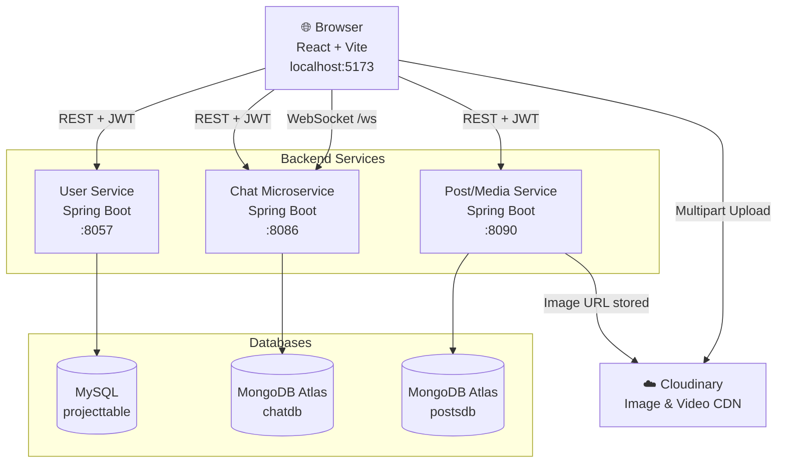

---

## Microservices Overview

| Service | Port | Language | Database | Key Responsibility |
|---|---|---|---|---|
| User Service | 8057 | Java / Spring Boot | MySQL | Auth, JWT, profile, follow/unfollow, search, email change |
| Chat Microservice | 8086 | Java / Spring Boot | MongoDB Atlas | Real-time messaging (WebSocket + REST history) |
| Post / Media Service | 8090 | Java / Spring Boot | MongoDB Atlas | Create posts & reels, feed, likes, comments |
| circleup-backend *(legacy)* | 8090 | Java / Spring Boot | MySQL | Basic user registration (early prototype) |

---

## 1. User Service (port 8057)

The central identity and social-graph service. Source code is not in this repository but all endpoints are inferred from the frontend.

### Architecture

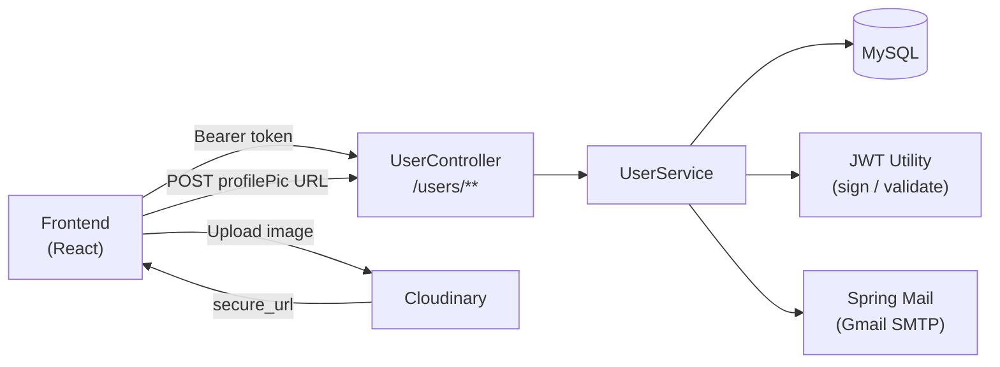

### Responsibilities

- **Registration & Login** — stores hashed passwords; issues signed JWT on login
- **JWT** — token payload contains `email`, `fullName`, `profilePic`; stored in a browser cookie (`userSession`, 1-day expiry)
- **Follow / Unfollow** — maintains bidirectional follower / following lists
- **User Search** — search by full name or email; returns list with profile details
- **Profile Updates** — change display name, update profile picture URL (after Cloudinary upload)
- **Email Change Flow** — sends confirmation email with signed token; user approves / rejects via `/updateemail` page
- **Password Recovery** — sends reset link to registered email

### API Endpoints

| Method | Path | Auth | Description |
|---|---|---|---|
| POST | `/users/signup` | None | Register a new account |
| POST | `/users/login` | None | Login; returns `200::<jwt>` |
| GET | `/users/getfullname` | Bearer | Get logged-in user's full name |
| GET | `/users/getfollowers` | Bearer | JSON array of follower objects |
| GET | `/users/getfollowing` | Bearer | JSON array of following objects |
| POST | `/users/follow` | Bearer | Follow another user by `targetEmail` |
| GET | `/users/search/{query}` | Bearer | Search users by name or email |
| GET | `/users/forgetpassword/{email}` | None | Send password-reset email |
| POST | `/users/updateprofilepic` | Bearer | Update profile picture URL |
| POST | `/users/updatefullname` | Bearer | Update display name |
| POST | `/users/request-email-change` | Bearer | Send confirmation to `newEmail` |
| GET | `/users/confirm-email-change?token=` | None | Approve email change |
| POST | `/users/cancel-email-change` | None | Cancel email change |

### Response Format

All responses follow the pattern `<status_code>::<message_or_data>`, e.g.:

```
200::Registration done successfully
401::email id already exists
200::<jwt_token>
```

---

## 2. Chat Microservice (port 8086)

Source: `socappback/microservice/`

### Architecture

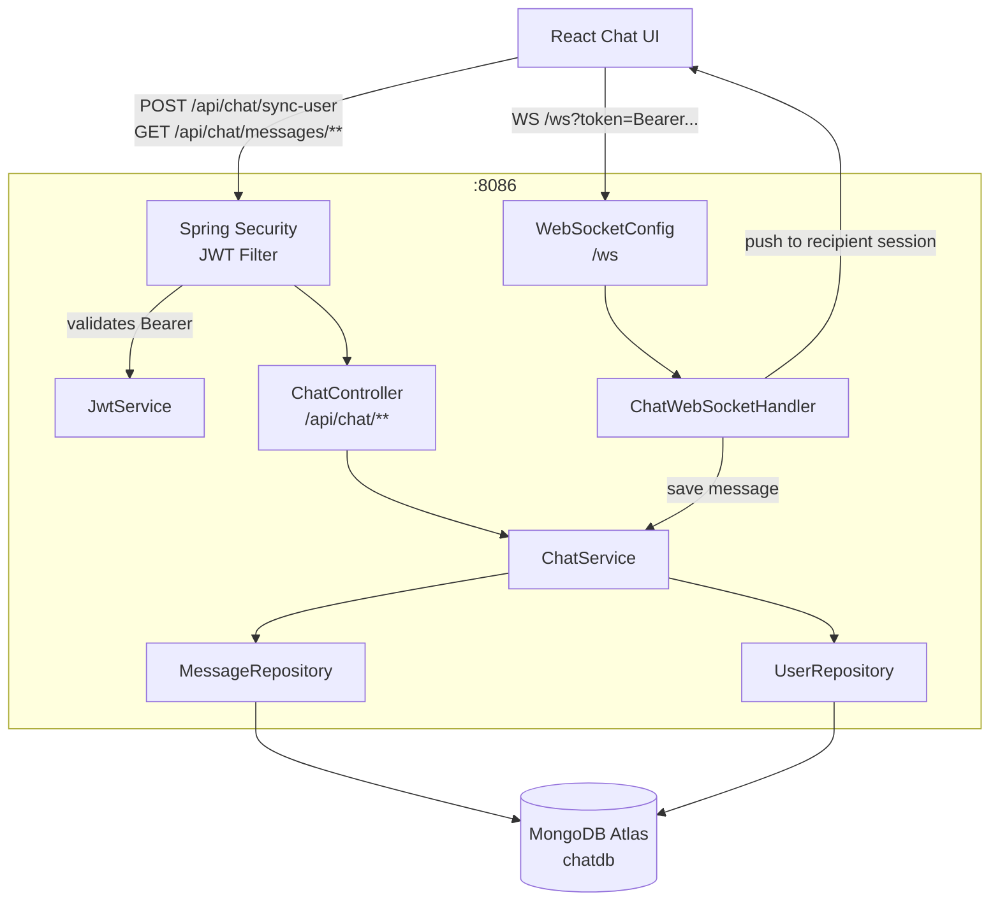

### Internal Components

| Class | Package | Role |
|---|---|---|
| `MicroserviceApplication` | `com.chat.microservice` | Spring Boot entry point |
| `SecurityConfig` | `config` | Stateless JWT filter chain; `/ws/**` is open |
| `JwtAuthenticationFilter` | `config` | Reads `Authorization: Bearer` header, sets `SecurityContext` |
| `JwtHandshakeInterceptor` | `config` | Validates JWT during WebSocket handshake; injects `email` attribute |
| `WebSocketConfig` | `config` | Registers `/ws` endpoint; allowed origin `localhost:5173` |
| `ChatController` | `controller` | REST: sync-user, fetch message history |
| `ChatWebSocketHandler` | `websocket` | In-memory session map; fan-out to recipient on message receipt |
| `ChatService` | `service` | Business logic: sync user, query/save messages |
| `JwtService` | `service` | Parses HMAC-signed JWT; returns email as subject |
| `Message` | `model` | MongoDB document — sender, receiver, content, timestamp, read |
| `User` | `model` | MongoDB document — email, fullName, profilePic, followers, following |
| `MessageRepository` | `repository` | Spring Data MongoDB — bidirectional conversation query |
| `UserRepository` | `repository` | Spring Data MongoDB — find by email |

### WebSocket Session Flow

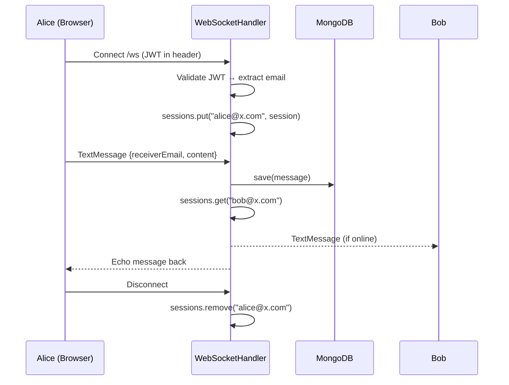

### API Endpoints

| Method | Path | Auth | Description |
|---|---|---|---|
| POST | `/api/chat/sync-user` | Bearer | Upsert user data (name, pic, followers, following) into chatdb |
| GET | `/api/chat/messages/{userEmail}/{otherEmail}` | Bearer | Retrieve full conversation history between two users |
| WS | `/ws` | Bearer (header) | Persistent WebSocket for real-time message delivery |

### Configuration (`application.properties`)

```properties
server.port=8086
spring.data.mongodb.uri=mongodb+srv://...@cluster0.okbkntf.mongodb.net/
spring.data.mongodb.database=chatdb
jwt.secret=<shared-secret-matching-user-service>
```

---

## 3. Post / Media Service (port 8090)

Source code is not committed to this repository. APIs are inferred from frontend (`Post.jsx`, `Home.jsx`, `Reels.jsx`).

### Architecture

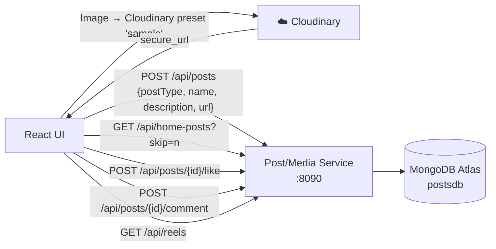

### Post Types

| `postType` | Upload method | Where stored |
|---|---|---|
| `image` | Frontend uploads to Cloudinary first; URL passed to service | Cloudinary CDN |
| `video` (reel) | Multipart `file` streamed directly to service | Service-managed storage |

### API Endpoints

| Method | Path | Auth | Description |
|---|---|---|---|
| POST | `/api/posts` | Bearer | Create a post; body is `multipart/form-data` with `postData` JSON + optional `file` |
| GET | `/api/posts` | Bearer | List the authenticated user's posts |
| GET | `/api/posts/{id}` | Bearer | Get a single post or reel by ID |
| GET | `/api/home-posts?skip={n}` | Bearer | Paginated home feed (5 per page, images only) |
| POST | `/api/posts/{id}/like` | Bearer | Toggle like on a post |
| POST | `/api/posts/{id}/comment` | Bearer | Add comment `{text}` to a post |
| GET | `/api/reels` | Bearer | Get all video reels |

### Post Document Structure (inferred)

```json
{
  "_id": "...",
  "userEmail": "alice@example.com",
  "postType": "image",
  "name": "Sunset",
  "description": "Beautiful evening",
  "url": "https://res.cloudinary.com/...",
  "likes": ["bob@example.com"],
  "comments": [
    { "userEmail": "bob@example.com", "text": "Amazing!" }
  ]
}
```

---

## 4. Legacy Registration Service — circleup-backend

Source: `socappback/circleup-backend/`

This is an early prototype of the user service. It provides only basic user registration backed by MySQL and has since been superseded by the full User Service.

### Architecture

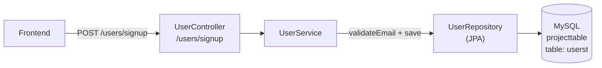

### Components

| Class | Role |
|---|---|
| `CircleupBackendApplication` | Spring Boot entry point |
| `UserController` | Exposes `POST /users/signup` |
| `UserService` | Checks for duplicate email; saves new user |
| `UserRepository` | JPA repository with custom email-validation query |
| `User` | JPA entity — `fullname`, `email` (PK), `password` |

### Configuration

```properties
server.port=8090
spring.datasource.url=jdbc:mysql://localhost:3306/projecttable
spring.jpa.hibernate.ddl-auto=update
```

### API Endpoints

| Method | Path | Auth | Description |
|---|---|---|---|
| POST | `/users/signup` | None | Register; returns `200::Registration done successfully` or `401::email id already exists` |

---

## 5. Frontend — React + Vite

Source: `social-media-app/`

### Component Tree

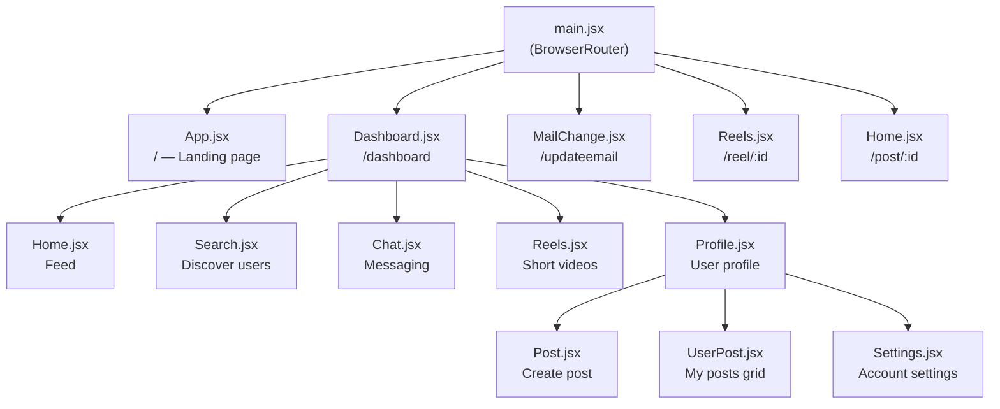

### Page / Component Details

| Component | Route / Location | Description |
|---|---|---|
| `App.jsx` | `/` | Landing page with background video, login and signup modals |
| `Dashboard.jsx` | `/dashboard` | Authenticated shell: top bar, side navigation, content outlet |
| `Home.jsx` | `/dashboard` → Home tab, `/post/:id` | Paginated image feed; like, comment, share (copy link) |
| `Search.jsx` | `/dashboard` → Search tab | Debounced user search (500 ms); follow button |
| `Chat.jsx` | `/dashboard` → Chat tab | List followers; open real-time chat; WebSocket via `socket.io-client` |
| `Reels.jsx` | `/dashboard` → Reels tab, `/reel/:id` | Video reel player with play/pause, mute, like, comment |
| `Profile.jsx` | `/dashboard` → Profile tab | Tabs: Posts, Followers, Settings |
| `Post.jsx` | Inside Profile → Posts tab | Create image or video post; images uploaded to Cloudinary |
| `UserPost.jsx` | Inside Profile → Posts tab | Grid of logged-in user's own posts |
| `Settings.jsx` | Inside Profile → Settings tab | Update profile pic, full name, change email |
| `MailChange.jsx` | `/updateemail?token=` | Email-change confirmation page (approve / reject) |

### Routing

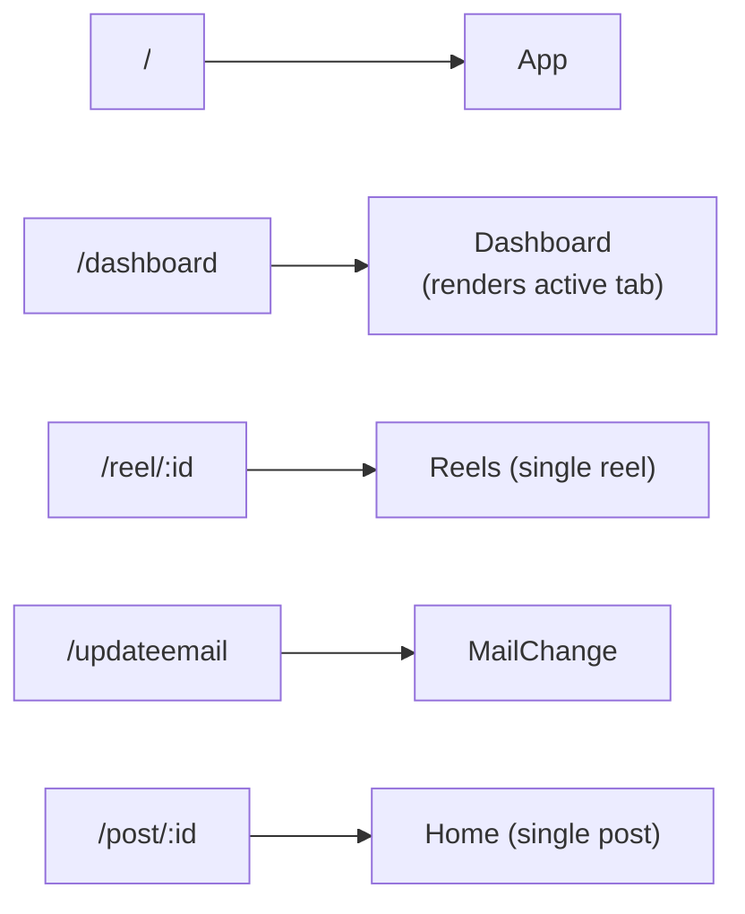

### State & API Layer (`api.js`)

```js
BaseUrl     = "http://localhost:8057/"   // User Service
BaseChatUrl = "http://localhost:8086/"   // Chat Microservice
BasePostUrl = "http://localhost:8090/"   // Post / Media Service
```

| Utility | Purpose |
|---|---|
| `callApi(method, url, data, handler, headers)` | Generic `fetch` wrapper; parses response as text |
| `setSession(name, value, days)` | Writes a secure cookie with expiry |
| `getSession(name)` | Reads a cookie value by name |

### Authentication in the Frontend

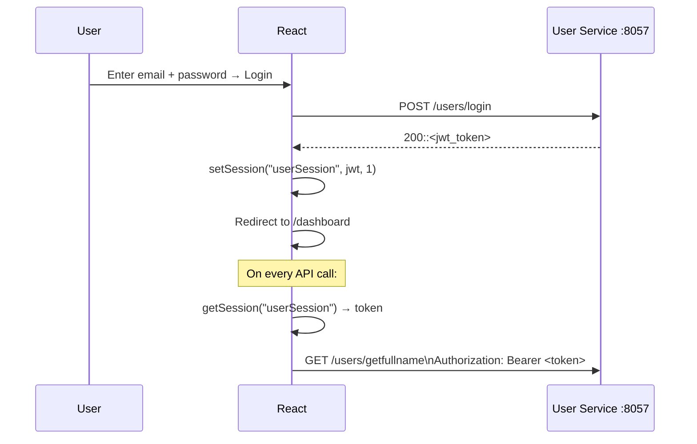

---

## Authentication & Session Flow

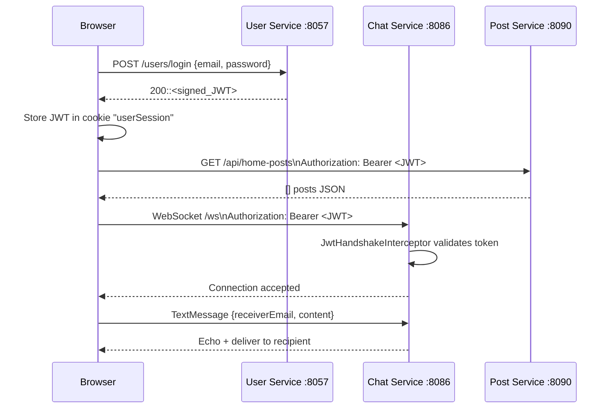

**JWT Payload** (claims embedded by User Service):

```json
{
  "sub": "alice@example.com",
  "email": "alice@example.com",
  "fullName": "Alice Smith",
  "profilePic": "https://res.cloudinary.com/..."
}
```

The Chat Service and Post Service both validate the same JWT using the shared `jwt.secret`. The Chat Service additionally stores a trimmed user snapshot in MongoDB (via `POST /api/chat/sync-user`) so it can display names and avatars inside chat without calling the User Service.

---

## API Reference

### Complete Endpoint Summary

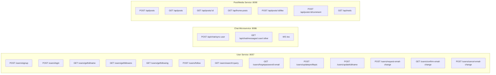

---

## Data Models

### Chat Microservice — MongoDB

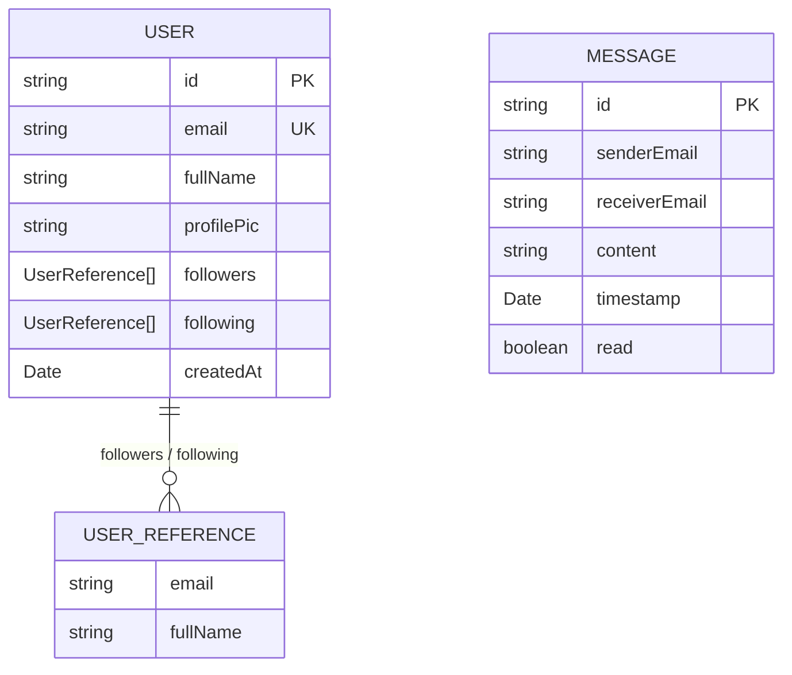

### circleup-backend — MySQL

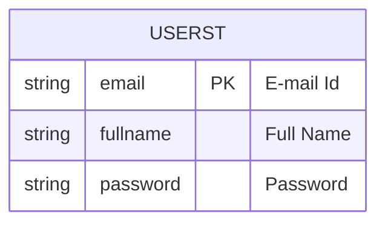

---

## Technology Stack

| Layer | Technology | Version |
|---|---|---|
| **Frontend** | React | 19.x |
| **Frontend bundler** | Vite + SWC plugin | 6.x |
| **Frontend routing** | React Router DOM | 7.x |
| **HTTP client** | Fetch API / Axios | — / 1.8 |
| **WebSocket client** | socket.io-client | 4.8 |
| **Utility** | lodash (debounce) | 4.17 |
| **Backend framework** | Spring Boot | 3.4.x |
| **Java version** | Java 17 (Chat), Java 21 (legacy) | — |
| **Build tool** | Maven | — |
| **Chat DB** | MongoDB Atlas | — |
| **Legacy user DB** | MySQL 8 | — |
| **JWT library** | JJWT (jjwt-api) | 0.12.6 |
| **Security** | Spring Security | 6.x |
| **Boilerplate** | Lombok | — |
| **Media CDN** | Cloudinary | cloud: `dyrotsqsv` |

---

## Getting Started

### Prerequisites

- Node.js 18+, npm
- Java 17+ and Maven
- MongoDB Atlas account (or local MongoDB)
- MySQL 8 (for circleup-backend)
- Cloudinary account (upload preset `sample`)

### 1. Frontend

```bash
cd social-media-app
npm install
npm run dev        # http://localhost:5173
```

### 2. Chat Microservice

```bash
cd socappback/microservice
# Edit src/main/resources/application.properties:
#   spring.data.mongodb.uri=<your-atlas-uri>
#   jwt.secret=<shared-secret>
./mvnw spring-boot:run   # http://localhost:8086
```

### 3. Legacy Registration Service (optional)

```bash
cd socappback/circleup-backend
# Edit src/main/resources/application.properties:
#   spring.datasource.url=jdbc:mysql://localhost:3306/projecttable
#   spring.datasource.username=root
#   spring.datasource.password=<your-password>
./mvnw spring-boot:run   # http://localhost:8090
```

### 4. User Service & Post Service

These services are not yet committed to the repository. Ensure both are running at `localhost:8057` and `localhost:8090` respectively before using the full application.

### Environment Summary

| Service | URL |
|---|---|
| Frontend | http://localhost:5173 |
| User Service | http://localhost:8057 |
| Chat Microservice | http://localhost:8086 |
| Post / Media Service | http://localhost:8090 |
